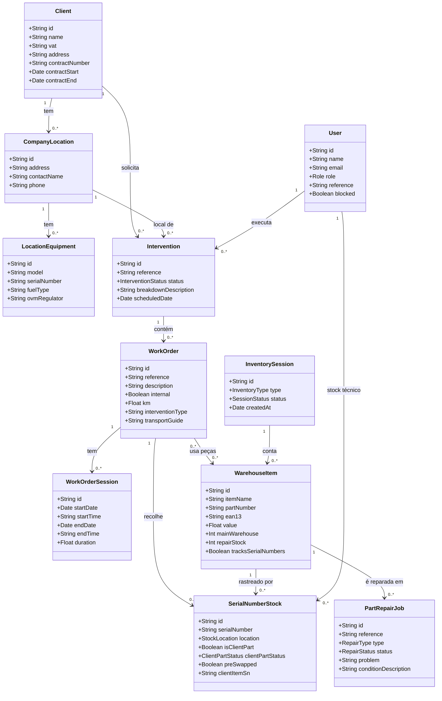
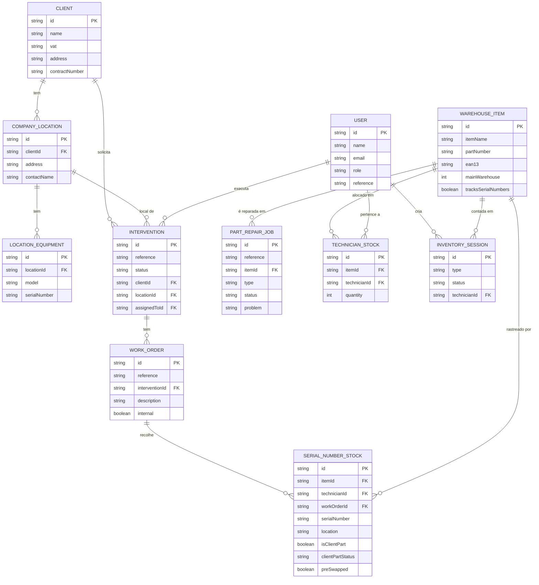
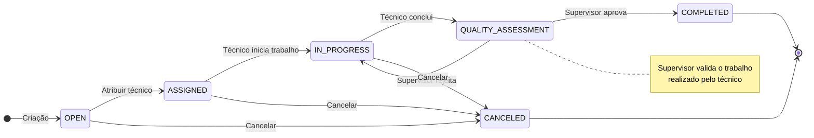
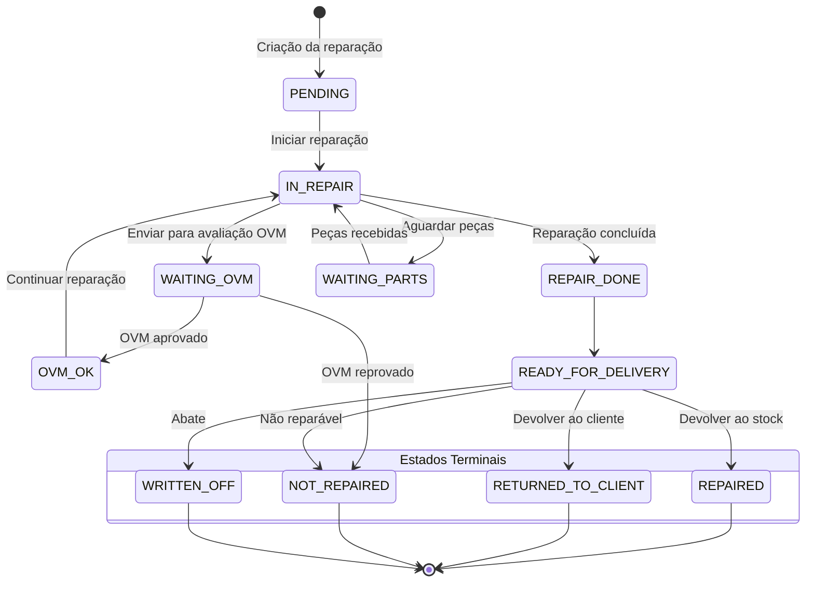
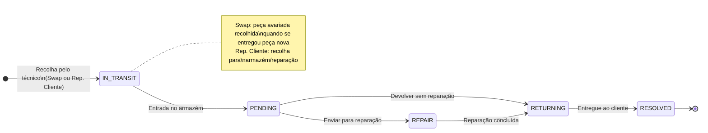
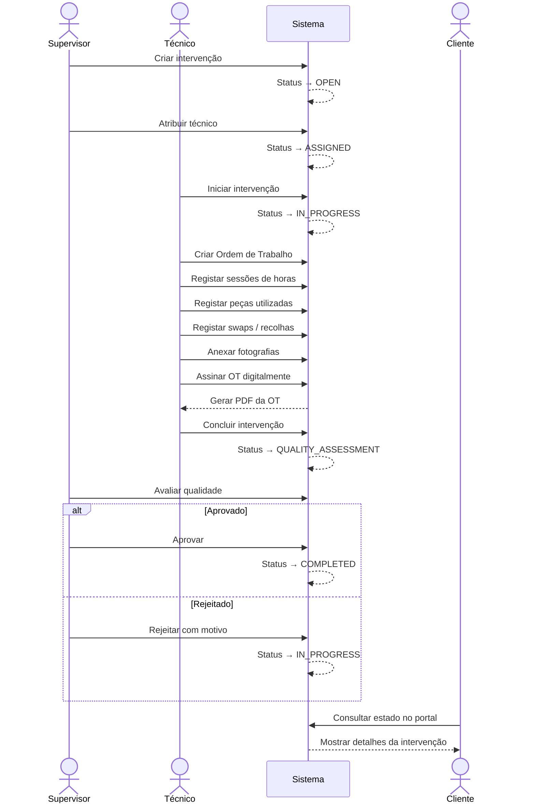
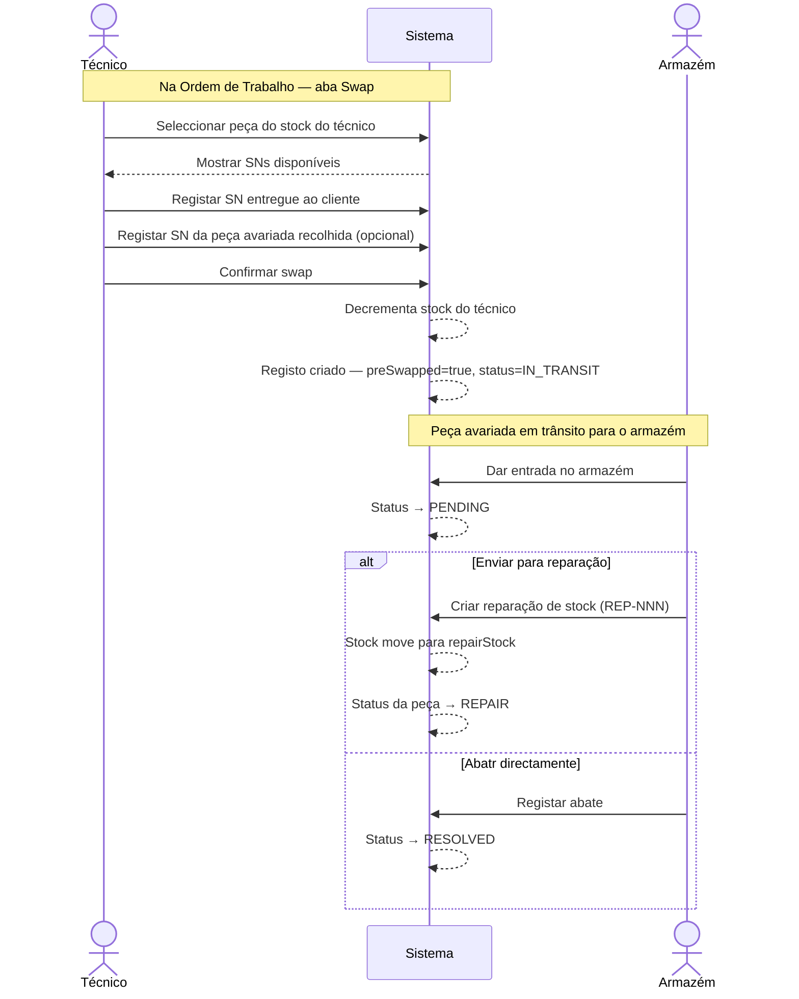
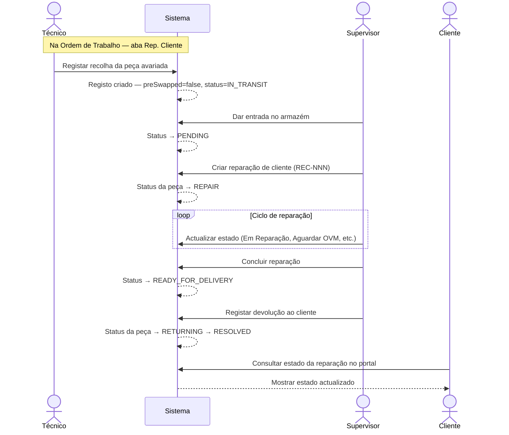
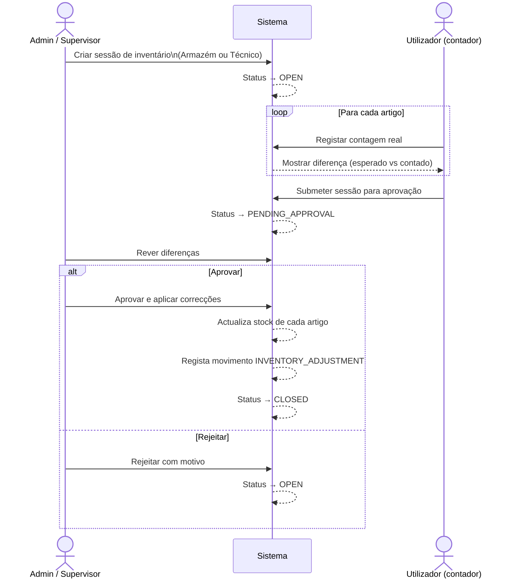

# Especificação de Produto — Sistema de Gestão de Intervenções e Armazém

**Cliente:** Losch Luxembourg  
**Versão:** 1.0  
**Data:** Maio 2025  
**Estado:** Requisitos iniciais para desenvolvimento

---

## 1. Introdução e Objectivos

A empresa necessita de um sistema web de gestão interna que centralize os processos de intervenção técnica em bombas e equipamentos de clientes, a gestão de armazém, o controlo de reparações e o acompanhamento de peças de clientes.

O sistema deve substituir os processos manuais actuais (papel, folhas de cálculo, e-mail) e proporcionar rastreabilidade completa desde a criação de uma intervenção até à sua conclusão e facturação.

### 1.1 Objectivos Principais

- Gerir o ciclo de vida completo de intervenções técnicas no terreno
- Controlar o stock de armazém central e o stock por técnico
- Acompanhar reparações de peças (stock interno e peças de clientes)
- Registar e monitorizar peças recolhidas em clientes
- Fornecer acesso ao cliente para consulta do seu histórico
- Suportar múltiplos idiomas (Português, Inglês, Espanhol)

---

## 2. Utilizadores e Perfis de Acesso

O sistema deve suportar quatro perfis distintos:

### 2.1 Administrador (ADMIN)
Acesso total ao sistema. Responsável pela configuração de dados-mestre, gestão de utilizadores, importações, e parametrização da empresa. Único perfil com acesso à área de administração.

### 2.2 Supervisor (SUPERVISOR)
Acesso completo às operações: clientes, intervenções, armazém, técnicos e reparações. Não tem acesso à gestão de utilizadores nem a importações de dados.

### 2.3 Técnico (TECHNICIAN)
Acesso restrito às suas intervenções atribuídas, ao seu stock pessoal e à base de conhecimento. Não vê dados de outros técnicos nem clientes não atribuídos.

### 2.4 Cliente (CLIENT)
Acesso exclusivo ao portal de cliente (área separada). Pode consultar as suas localizações, equipamentos, intervenções e reparações. Não acede à área de gestão interna.

---

## 3. Módulos Funcionais

---

### 3.1 Dashboard

O ecrã inicial deve apresentar uma visão geral do estado operacional. O conteúdo deve variar consoante o perfil do utilizador.

**Para Supervisores/Administradores:**
- Número de intervenções abertas, em progresso e concluídas
- Intervenções com avaliação de qualidade pendente
- Reparações activas e em curso
- Peças de clientes em trânsito ou em armazém
- Atalhos rápidos para as acções mais frequentes

**Para Técnicos:**
- As suas intervenções atribuídas e respectivo estado
- Atalho para registar horas e peças utilizadas

---

### 3.2 Clientes e Localizações

#### 3.2.1 Gestão de Clientes
O sistema deve permitir criar e gerir uma ficha de cliente com:
- Nome, NIF (com validação VIES para VAT europeu), morada, contactos (telefone, e-mail)
- Informação de contrato (número, data de início e fim, valor mensal)
- Listagem de localizações e equipamentos associados
- Possibilidade de criar um utilizador do tipo CLIENT associado ao cliente

#### 3.2.2 Localizações
Cada cliente pode ter múltiplas localizações (instalações, postos de bomba). Cada localização tem:
- Morada, contacto responsável, notas
- Lista de equipamentos instalados

#### 3.2.3 Equipamentos por Localização
Cada localização pode ter vários equipamentos registados:
- Tipo de equipamento, marca, modelo, número de série
- Tipo de combustível, tipo de regulador OVM, observações
- Histórico de intervenções nesse equipamento

---

### 3.3 Intervenções

O módulo central do sistema. Gere o ciclo de vida completo de uma visita técnica.

#### 3.3.1 Criação de Intervenção
Uma intervenção regista:
- Cliente e localização
- Técnico atribuído
- Descrição da avaria/trabalho solicitado
- Data prevista
- Estado inicial: **Aberta**

#### 3.3.2 Estados de uma Intervenção
A intervenção percorre os seguintes estados, em sequência:

| Estado | Descrição |
|--------|-----------|
| OPEN | Criada, ainda não atribuída ou iniciada |
| ASSIGNED | Atribuída a um técnico |
| IN_PROGRESS | Técnico no terreno |
| QUALITY_ASSESSMENT | Trabalho concluído, aguarda validação de qualidade |
| COMPLETED | Aprovada e encerrada |
| CANCELED | Cancelada |

#### 3.3.3 Ordens de Trabalho
Uma intervenção pode ter várias ordens de trabalho. Cada ordem de trabalho regista:
- Descrição detalhada do trabalho executado
- Tipo (Interno / Externo)
- Tipo de intervenção: Electrónica, Hidráulica, Informática, Outros
- Km percorridos e morada de origem (para ordens externas)
- Viatura(s) utilizada(s)
- Técnicos auxiliares (ajudantes)
- Guia de transporte
- Referência da ordem de trabalho (gerada automaticamente)

**Sessões de trabalho (horas):** Cada ordem pode ter várias sessões com data/hora de início e fim, calculando automaticamente a duração.

**Peças utilizadas:** Registo das peças retiradas do stock e aplicadas na intervenção, com rastreabilidade de número de série quando aplicável.

**Swap (Substituição Imediata):** Quando o técnico substitui uma peça avariada por uma peça do seu stock no momento da visita. Regista a peça entregue ao cliente (com SN se disponível) e a peça avariada recolhida.

**Recolha de Peça de Cliente:** Quando o técnico recolhe uma peça avariada do cliente para enviar para reparação ou armazém, sem substituição imediata.

**Assinatura e PDF:** A ordem de trabalho pode ser assinada digitalmente (técnico e cliente) e exportada em PDF. O sistema deve guardar um histórico dos PDFs gerados.

#### 3.3.4 Fotografias
Possibilidade de anexar fotografias à intervenção (antes/durante/depois do trabalho).

#### 3.3.5 Histórico
Registo automático de todas as alterações de estado com data, hora e utilizador responsável.

---

### 3.4 Armazém

Gestão centralizada do inventário de peças e materiais.

#### 3.4.1 Artigos de Armazém
Cada artigo tem:
- Nome, número de peça (part number), código EAN-13 (gerado automaticamente se não existir)
- Categoria, valor unitário
- Quantidades: armazém principal, stock em reparação, stock de abate
- Indicador se rastreia números de série individualmente

#### 3.4.2 Rastreabilidade por Número de Série
Para artigos que requerem rastreabilidade individual:
- Cada unidade tem um número de série registado
- O sistema rastreia a localização de cada SN: armazém, técnico, reparação, cliente
- Histórico de movimentos por número de série

#### 3.4.3 Movimentos de Stock
O sistema regista automaticamente todos os movimentos:
- Entrada de stock
- Saída de stock
- Transferência para técnico / devolução de técnico
- Entrada para reparação / saída de reparação
- Abate / destruição
- Ajuste de inventário

#### 3.4.4 Stock por Técnico
Cada técnico tem um stock pessoal (peças que leva para o terreno):
- Atribuição de peças do armazém central ao técnico
- Consulta do stock actual do técnico
- Devolução de peças ao armazém

#### 3.4.5 Inventários
O sistema deve suportar sessões de inventário periódico:
- Tipo: Armazém central ou stock de técnico
- O utilizador regista as contagens reais
- O sistema compara com o stock esperado e calcula diferenças
- Fluxo de aprovação antes de aplicar correcções
- Registo histórico de todos os inventários

---

### 3.5 Reparações

Gestão de trabalhos de reparação de peças, com dois tipos distintos:

#### 3.5.1 Reparação de Stock (STOCK)
Peça avariada retirada do stock da empresa para reparação interna ou externa.
- Referência automática no formato `REP-NNN/AAAA`
- Registo da peça, número de série (se aplicável), problema descrito
- Condição da peça e acessórios incluídos

#### 3.5.2 Reparação de Cliente (CLIENT)
Peça do cliente entregue para reparação.
- Referência automática no formato `REC-NNN/AAAA`
- Associação ao cliente e localização
- Número de série da peça do cliente
- Condição e acessórios incluídos

#### 3.5.3 Estados da Reparação

| Estado | Descrição |
|--------|-----------|
| PENDING | Criada, aguarda início |
| IN_REPAIR | Em reparação activa |
| REPAIR_DONE | Reparação concluída, aguarda validação |
| WAITING_OVM | Aguarda aprovação OVM |
| OVM_OK | OVM aprovado |
| WAITING_PARTS | Aguarda peças para continuar |
| READY_FOR_DELIVERY | Pronta para entrega/devolução |
| REPAIRED | Concluída — devolvida ao stock |
| RETURNED_TO_CLIENT | Concluída — devolvida ao cliente |
| NOT_REPAIRED | Não foi possível reparar |
| WRITTEN_OFF | Enviada para abate |

Os estados intermédios (`IN_REPAIR` a `READY_FOR_DELIVERY`) são seleccionáveis livremente. Os estados terminais são accionados pelo botão "Concluir Reparação".

#### 3.5.4 Histórico e Progresso
Linha cronológica de todas as alterações de estado, com data e utilizador, visível na ficha da reparação.

#### 3.5.5 Fotografias
Possibilidade de anexar fotografias à reparação.

#### 3.5.6 Peças Consumidas
Registo das peças do armazém utilizadas durante a reparação.

#### 3.5.7 Orçamento
Para reparações de cliente, possibilidade de emitir e gerir orçamentos de reparação.

---

### 3.6 Peças de Clientes

Módulo para acompanhar o ciclo de vida das peças recolhidas em clientes, desde a recolha até à resolução final.

#### 3.6.1 Estados de uma Peça de Cliente

| Estado | Descrição |
|--------|-----------|
| IN_TRANSIT | Recolhida pelo técnico, em trânsito para armazém |
| PENDING | Recebida no armazém, aguarda decisão |
| REPAIR | Enviada para reparação |
| RETURNING | Em processo de devolução ao cliente |
| RESOLVED | Processo concluído |

#### 3.6.2 Acções Disponíveis
- Dar entrada no armazém (IN_TRANSIT → PENDING)
- Enviar para reparação (PENDING → REPAIR)
- Fazer swap (devolver peça reparada/nova ao cliente)
- Registar devolução ao cliente
- Enviar de volta ao técnico

---

### 3.7 Base de Conhecimento (Fórum Interno)

Espaço de partilha de conhecimento entre técnicos e supervisores.
- Publicação de posts com título e conteúdo
- Respostas encadeadas
- Marcação de resposta como solução
- Pesquisa e filtro por categoria

---

### 3.8 Manuais

Repositório de documentação técnica e manuais de equipamentos.
- Upload e organização de manuais
- Pesquisa por nome/tipo de equipamento

---

### 3.9 Portal do Cliente

Área de acesso restrito para utilizadores do tipo CLIENT.
- Consulta das suas localizações e equipamentos
- Histórico de intervenções (resumo e detalhes)
- Estado das reparações em curso

---

### 3.10 Administração

Área exclusiva para o perfil ADMIN.

#### 3.10.1 Gestão de Utilizadores
- Criar, editar e bloquear utilizadores
- Atribuir perfis (ADMIN, SUPERVISOR, TECHNICIAN, CLIENT)
- Associar utilizadores CLIENT a fichas de cliente

#### 3.10.2 Dados de Empresa
- Logótipo, nome, morada, telefones, faxes, e-mail
- Estes dados são utilizados nos PDFs gerados

#### 3.10.3 Dados-Mestre
- Tipos de equipamento e marcas
- Tipos de combustível
- Reguladores OVM
- Categorias de artigos de armazém
- Viaturas da empresa

#### 3.10.4 Templates de Etiquetas
- Configuração de templates de etiquetas para impressão de artigos de armazém com código EAN-13

#### 3.10.5 Importações
- Importação em massa de clientes (via ficheiro)
- Importação em massa de artigos de armazém (via ficheiro)

---

## 4. Requisitos de Geração de Referências

O sistema deve gerar automaticamente referências únicas para os seguintes registos:

| Entidade | Formato | Exemplo |
|----------|---------|---------|
| Ordem de Trabalho | `OT-NNN/AAAA` | OT-042/2025 |
| Reparação de Stock | `REP-NNN/AAAA` | REP-015/2025 |
| Reparação de Cliente | `REC-NNN/AAAA` | REC-007/2025 |
| Utilizador | `USR-NNN` | USR-003 |

Os contadores devem ser reiniciados por ano civil para reparações e ordens de trabalho.

---

## 5. Requisitos Não Funcionais

### 5.1 Autenticação e Segurança
- Autenticação por e-mail e password com token JWT
- Sessões com expiração e renovação automática
- Bloqueio de conta por administrador
- Todas as rotas de API protegidas por token

### 5.2 Internacionalização
- Interface disponível em Português (PT), Inglês (EN) e Espanhol (ES)
- Selecção de idioma por utilizador/URL

### 5.3 Responsividade
- A interface deve ser utilizável em computador e tablet
- Formulários e listagens devem adaptar-se ao tamanho do ecrã

### 5.4 Performance
- Listagens com muitos registos devem ser paginadas ou filtradas
- Carregamento de stock de técnico deve ser feito de forma lazy (apenas quando necessário)

### 5.5 Exportação PDF
- As ordens de trabalho devem poder ser exportadas em PDF com dados da empresa, cliente, trabalho realizado e campos de assinatura

### 5.6 Validação de VAT Europeu
- Integração com o serviço VIES da Comissão Europeia para validação de NIF/VAT de clientes

---

## 6. Modelo de Dados — Entidades Principais

| Entidade | Descrição |
|----------|-----------|
| User | Utilizadores do sistema (todos os perfis) |
| Client | Fichas de clientes empresariais |
| CompanyLocation | Instalações/locais de cada cliente |
| LocationEquipment | Equipamentos instalados em cada local |
| Intervention | Registo de cada intervenção técnica |
| WorkOrder | Ordem de trabalho dentro de uma intervenção |
| WorkOrderSession | Sessão de tempo dentro de uma ordem de trabalho |
| WorkOrderPart | Peça utilizada numa ordem de trabalho |
| WarehouseItem | Artigo do catálogo de armazém |
| TechnicianStock | Stock atribuído a um técnico |
| SerialNumberStock | Rastreabilidade individual por número de série |
| ItemMovement | Registo de cada movimento de stock |
| PartRepairJob | Trabalho de reparação de peça |
| RepairHistory | Histórico de estados de uma reparação |
| InventorySession | Sessão de contagem de inventário |
| InventoryEntry | Contagem por artigo numa sessão de inventário |
| CompanyVehicle | Viaturas da empresa |
| ForumPost | Post da base de conhecimento |
| ForumReply | Resposta a um post |
| Manual | Documento/manual técnico |
| SystemSetting | Configurações globais do sistema |

---

## 7. Fluxos de Trabalho Principais

### 7.1 Fluxo de Intervenção
```
Criação → Atribuição ao técnico → Técnico no terreno →
Registo de horas, peças, fotografias, ordens de trabalho →
Conclusão → Avaliação de qualidade → Aprovação e encerramento
```

### 7.2 Fluxo de Reparação de Stock
```
Peça avariada detectada → Criação de reparação (REP-NNN) →
Peça move do armazém para stock de reparação →
Estados intermédios (Em Reparação, Aguardar OVM, etc.) →
Concluir → Devolver ao stock / Abate
```

### 7.3 Fluxo de Reparação de Cliente
```
Técnico recolhe peça do cliente (via Ordem de Trabalho) →
Peça fica Em Trânsito → Armazém dá entrada (PENDING) →
Decisão: reparar (REC-NNN) ou devolver →
Reparação concluída → Devolução ao cliente
```

### 7.4 Fluxo de Swap (Substituição Imediata)
```
Técnico leva peça do seu stock para o cliente →
No terreno: entrega peça nova, recolhe peça avariada →
Registo na Ordem de Trabalho (aba Swap): SN entregue + SN recolhido →
Peça avariada fica Em Trânsito para armazém →
Armazém recebe e decide: reparar ou abatr
```

### 7.5 Fluxo de Inventário
```
Admin/Supervisor cria sessão de inventário →
Utilizadores registam contagens reais por artigo →
Sistema calcula diferenças (esperado vs contado) →
Aprovação pelo supervisor →
Correcções aplicadas ao stock
```

---

## 8. Integrações Externas

| Integração | Propósito |
|-----------|-----------|
| VIES (Comissão Europeia) | Validação de NIF/VAT europeu na ficha de cliente |
| Serviço de e-mail (SMTP) | Envio de notificações e documentos por e-mail |

---

## 9. Estrutura de Navegação

### Menu Principal (Supervisores e Administradores)
- Dashboard
- Clientes
- Intervenções
- Armazém
  - Artigos
  - Técnicos (stock por técnico)
  - Inventários
- Reparações
- Manuais
- Base de Conhecimento
- Administração *(apenas ADMIN)*
  - Utilizadores
  - Empresa
  - Dados-Mestre (Tipos, Marcas, Combustíveis, OVM, Categorias)
  - Viaturas
  - Templates de Etiquetas
  - Importações

### Menu Principal (Técnicos)
- Dashboard
- Intervenções (apenas as atribuídas)
- Manuais
- Base de Conhecimento

### Portal do Cliente (separado)
- As minhas localizações e equipamentos
- As minhas intervenções
- As minhas reparações

---

*Documento preparado para efeitos de especificação e alinhamento. Qualquer alteração ao âmbito deve ser registada e aprovada por ambas as partes.*

---

## Anexo A — Diagramas UML

> Os diagramas seguintes estão em formato **Mermaid** e renderizam automaticamente no VS Code (extensão Markdown Preview Mermaid), GitHub, e GitLab.

---

### A.1 Diagrama de Casos de Uso

```mermaid
graph TB
  ADMIN((Administrador))
  SUP((Supervisor))
  TECH((Técnico))
  CLI((Cliente))

  subgraph Administração
    UC1[Gerir Utilizadores]
    UC2[Configurar Empresa]
    UC3[Importar Dados]
    UC4[Gerir Dados-Mestre]
  end

  subgraph Operações
    UC5[Gerir Clientes e Localizações]
    UC6[Gerir Intervenções]
    UC7[Gerir Armazém e Stock]
    UC8[Gerir Reparações]
    UC9[Acompanhar Peças de Cliente]
    UC10[Gerir Inventários]
  end

  subgraph Terreno
    UC11[Executar Intervenção]
    UC12[Registar Horas e Peças]
    UC13[Registar Swap]
    UC14[Registar Recolha de Peça]
  end

  subgraph Portal do Cliente
    UC15[Consultar Intervenções]
    UC16[Consultar Reparações]
    UC17[Consultar Equipamentos]
  end

  ADMIN --> UC1
  ADMIN --> UC2
  ADMIN --> UC3
  ADMIN --> UC4
  ADMIN --> UC5
  ADMIN --> UC6
  ADMIN --> UC7
  ADMIN --> UC8
  ADMIN --> UC9
  ADMIN --> UC10

  SUP --> UC5
  SUP --> UC6
  SUP --> UC7
  SUP --> UC8
  SUP --> UC9
  SUP --> UC10

  TECH --> UC11
  TECH --> UC12
  TECH --> UC13
  TECH --> UC14

  CLI --> UC15
  CLI --> UC16
  CLI --> UC17
```



---

### A.2 Diagrama de Classes — Modelo de Dados Principal



---

### A.3 Diagrama Entidade-Relação (ERD)



---

### A.4 Diagrama de Estados — Intervenção



---

### A.5 Diagrama de Estados — Reparação



---

### A.6 Diagrama de Estados — Peça de Cliente



---

### A.7 Diagrama de Sequência — Fluxo de Intervenção Completo



---

### A.8 Diagrama de Sequência — Fluxo de Swap (Substituição Imediata)



---

### A.9 Diagrama de Sequência — Fluxo de Reparação de Peça de Cliente



---

### A.10 Diagrama de Sequência — Fluxo de Inventário


